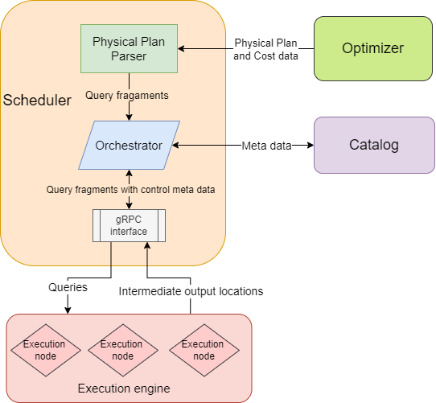

# 15721-s24-scheduler1
15-721 Spring 2024 - Scheduler #1

* Aditya Chanana (achanana)
* Shivang Dalal (shivangd)
* George (chaoqil)

## Overview
The goal of this project is to develop a portable query scheduler/coordinator for a distributed OLAP database. The scheduler will be responsible for parsing a physical query plan provided by the query optimizer, creating small query fragments, and executing them through the execution engine. We aim to achieve some measure of fairness. At this stage we define it loosely as the prioritization of queries with shorter job durations over long-running queries. An eventual goal is to find a suitable metric which can be incorporated as a part of the benchmark.

The two main components of the scheduler will be:

1. **Physical Plan Parser**: Takes care of parsing the physical plan and breaking it up into different fragments/operators to target intra-query parallelism. Our initial focus will be on parallelizing within a single query. Later we will work on intra-operator parallelism using table partitions and inter-query parallelism to achieve fairness. It will also coordinate with the Catalog to retrieve more metadata when considering data partitions and data locality.

2. **Orchestrator**: Responsible for coordinating the query fragments through the execution engine and propagating the errors and the final result upwards through the different components.

We will draw inspiration from papers focusing on scheduling, such as [Quickstep](https://pages.cs.wisc.edu/~jignesh/publ/Quickstep.pdf) and [Morsel-Driven Parallelism](https://db.in.tum.de/~leis/papers/morsels.pdf). However, our primary goal will be to set up a working scheduler by the end of 15-721 and incrementally add optimizations.

## Architectural Design

In the first version, we will have a single scheduler instance that will run on only one node. We will begin by assuming that only one query will be running on the system at a time, and focus on exploiting intra-query parallelism.

The intermediate results of query fragments will be stored on the local disk of the execution engine. The execution engine will associate an identifier with each intermediate result, and return it with the job done callback.

This identifier will be sent to the execution engine as part of the job parameters of subsequent query fragments.



### Accepting physical plans from the optimizer

We will listen for gRPC messages from the optimizer to accept physical plans. These messages should include the estimated query execution cost so we can make prioritization decisions.

### Generating query fragments

Viewing the physical plan as a DAG, query fragments will be generated bottom up. The parent fragment will be scheduled for execution only when all child fragments have been scheduled. Each fragment will be tagged with metadata for identifying its dependencies. We can traverse a DAG using BFS and schedule the traversal in reverse order to achieve this. Depending on the execution engine's method of processing - push or pull, we'll need to either send multiple fragments demarcated by pipeline breakers or we'll send one fragment per scheduling request.[](https://)

### Feeding query fragments to the execution engine

We will be maintaining a work queue in the scheduler that will contain query fragments to be executed on the execution engine. We will be making gRPC calls to the execution engine that will submit query fragments for execution.

Maintaining the work queue on the scheduler can create low throughput on the execution node if new query fragments are submitted only after notification of completion of currently submitted query fragments is received. This can be mitigated by having the execution engine deliver pre-fetch requests to the scheduler.

Each query fragment will contain information about the query it belongs to, the fragments it depends on, and whether it is the final query fragment (which allows for pushing the result directly back to the requesting client instead of sending data up the different components).

### Locality considerations

We will specify a region_id for each query fragment that's sent to the execution engine. It should be assumed that queries with the same region_id benefit from being executed in the same NUMA region.

For now, we also assume there is a coarser-grained measure of locality that can be retrieved from the catalog service for the storage of the data and the execution node. For example, the catalog service might be able to show that certain tables already reside on the execution node as a result of previous queries. If available, we will use this detail to decide how to schedule query fragments to exploit locality.

### Shuffle considerations

In a distributed setting we'll need to consider shuffling data across execution nodes, especially if we want to deal with partitioned tables. We propose including destination addresses in fragment metadata and rewriting queries to include filter clauses and unions to instruct the execution nodes to send intermediate query results to each other.

### Configuration knobs

We will provide configuration knobs for the following:
- The maximum number of query plans queued at a time. When this limit is reached we will return an error to the query optimizer.
- The rate of priority decay for longer-running queries. This will determine the point at which query fragments from newer queries will pre-empt query fragments from these longer-running queries.
- The timeout, if any, for each query execution.
- The amount of memory that the scheduler can use (soft limit).
- The amount of disk space that is reserved for the scheduler (thinly provisioned).

### Implementation details

We expect to receive [Substrait](https://substrait.io) physical query plans from the optimizer.

## Design Rationale

Since the execution engine is single node, we are limited in the extent of opportunistic scheduling we can do apart from query fragmentation.

### Why maintain a work queue on the scheduler?

By maintaing a work queue on the scheduler we have increased control over the next query fragment that will be executed. We can, for instance, choose to insert a query fragment from a new query at the front of the queue when the currently running query has been running for a long-enough duration and thus has decayed priority. This would help rein in tail query processing times when we have a mix of longer and shorter running queries.

## Trade-offs and Potential Problems
The basic architectural design is very straightforward yet extendable enough to accommodate optimizations and future improvements.

Some of the major trade-offs we will have to make are primarily due to the time constraints on the project and the restrictions/simplifying assumptions set by the instructors. For example, to limit the scope of the project, we will not be working on inter-query parallelism. Another trade-off is opting not to have a central queue for queries/query fragments, which could potentially be added later to support a higher degree of throughput.

The major problem we foresee is the coordination between different components like the catalog, query optimizer, and the execution engine that we have to manage, maintaining a consistent view of the database at all times.

We are choosing to only submit query fragments one at a time to the execution engine to increase control over re-prioritization of query fragments. Even with pre-fetching, this design has the potential to cause delays in fetching new query fragments to execute in the execution engine, whether it is because of flaky networks or just high network latency between the scheduler and execution engine instances. Instead, the scheduler could submit all query fragments created from a query to the execution engine at once. However, this approach would require the scheduler to explicitly request the execution engine to reorder work items, or insert new work items at the front of the queue. This makes the API between the two components more complicated.

### Push vs pull for query fragments
We make the following observations regarding pushing fragments versus pulling fragments between the scheduler and the execution engine:
- Pushed based will allow for better pipelining if the execution engine does not pre-fetch. There will be more complexity on the execution engine side since it will need a priority queue to keep track of fragments pushed due to re-prioritizations.
- Pull based will have better control for the execution engine and less complexity, but poorer performance due to no pipelining.
- Pulling with pre-fetching will result in good performance only for longer running fragments. If the fragment finishes executing before the next fragment can arrive, we will still lose performance. We can vary how many pre-fetch requests the execution engine will make to keep the pipeline full, but this will delay how soon high priority fragments will be executed. For example, if we pre-fetch one fragment only, high priority fragments will be delayed for at most one fragment but our pipeline will only contain one fragment ready for execution. We think this trade-off may be acceptable if we assume OLAP fragments are mostly long running and we choose the right number of fragments we pre-fetch.

### Unaddressed problems
It is not yet clear to us what is the best way of propagating the results of the query to the DataFusion front-end. Passing the query results to the query optimizer so that it, in turn, can pass the them further up the stack seems unnecessary and wasteful. It seems more intuitive to send the output directly to the DataFusion frontend, which the execution engine can perhaps do. However, we still need to figure out a way to designate the desired destination of the query results that can be passed down the stack.

## Testing Plan
We plan to allocate a significant portion of time to testing, as we firmly believe that working code surpasses all hype. Specifically, we aim to create comprehensive unit tests and ensure high code coverage for these tests. Rust provides a flag for LLVM source-based code coverage profiling (-C instrument-coverage), which will assist us in achieving this.

For testing both the correctness and performance of our optimizer, we will utilize mock physical plans and a mock executor. Unit tests will be written to verify individual functions and components. Regression testing will be conducted in two parts: first, to validate the generation of correct query fragments by the plan parser, and second, to assess the operation of the orchestrator. Lastly, we will conduct end-to-end tests for the entire scheduler, incorporating supporting mock components.

The estimated costs associated with each query fragment are received from the optimizer. This cost can be used to score a particular query execution run orchestrated by the scheduler and will help identify regressions in the performance of our scheduling logic.

## API specification
### Overview
```protobuf=
// Metadata related to a query that the optimizer sends
// when submitting a query to the scheduler for execution.
message QueryInfo {
    // The priority of the query.
    int32 priority = 1;

    // The estimated cost of query execution.
    int32 cost = 2;

    // information about how to send the query results
    // to the front end?
}

// The status of the query.
enum QueryStatus {
    // The query is done.
    DONE = 0;

    // The query is in progress.
    IN_PROGRESS = 1;

    // The query has failed.
    FAILED = 2;

    // The query was not found.
    NOT_FOUND = 3;

    // Request from the execution engine to send the next query
    // fragment.
    PREFETCH_NEXT = 4;
}

// Information required to schedule a query.
message ScheduleQueryArgs {
    // A Substrait physical plan.
    bytes physical_plan = 0;

    // Metadata related to the query.
    QueryInfo metadata = 1;
}

// Information returned from the ScheduleQuery RPC.
message ScheduleQueryRet {
    // The identifier to refer to this query execution.
    int32 query_id = 1;
}

// Arguments required to query the status of a job.
message QueryJobStatusArgs {
    // The id of the query to get the status of.
    int32 query_id = 1;
}

// Information returned from the QueryJobStatus RPC.
message QueryJobStatusRet {
    // The status of the job.
    enum QueryStatus = 1;
}

// Arguments required for the QueryExecutionDone RPC.
message QueryExecutionDoneArgs {
    // The query fragment whose execution is complete.
    int32 fragment_id = 1;

    // The status of query execution.
    QueryStatus status = 2;
}

// Information returned from the QueryExecutionDone RPC.
message QueryExecutionDoneRet {

}

// The scheduler API.
service Scheduler {
    // Used by the optimizer to schedule a new query.
    rpc ScheduleQuery(ScheduleQueryArgs) returns (SchedulePlanRet);

    // Used by the optimizer to query the status of a job.
    rpc QueryJobStatus(QueryJobStatusArgs) returns (QueryJobStatusRet);

    // Used by the execution engine to notify the scheduler that
    // the execution of query fragment is complete.
    rpc QueryExecutionDone(QueryExecutionDoneArgs)
        returns (QueryExecutionDoneRet);
}
```

### Encoding
Communication between different parts of the system will be through gRPC.
### Error Handling
Error handling could involve bubbling the result up the layers or sending a error to the client stub.

While sending the error directly back to the client is more efficient, the client stub would be passed through all layers of the system. Thus, all layers would need to coordinate when sending an error message back to the client (who would send a successfully executed query is much clearer in comparison).

We'll bubble the error up the layers up instead.

## References
https://docs.rs/datafusion/latest/datafusion/
https://pages.cs.wisc.edu/~jignesh/publ/Quickstep.pdf
https://db.in.tum.de/~leis/papers/morsels.pdf
