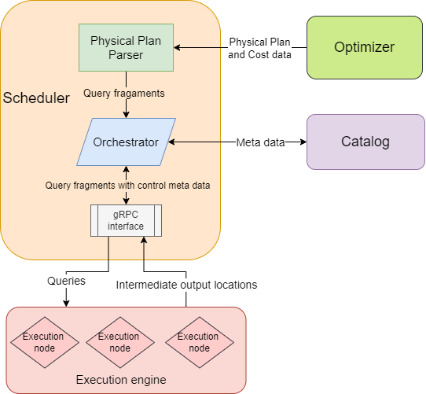
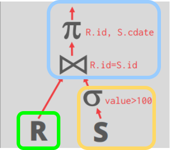

# Chronos - Scheduler Team 1

* Aditya Chanana (achanana)
* Shivang Dalal (shivangd)
* George (chaoqil)

## Overview
The objective of this project is to create a portable query scheduler/coordinator for a distributed OLAP database. This scheduler's role encompasses parsing a physical query plan generated by the query optimizer, splitting the query into fragments, and orchestrating their execution via the execution engine. Central to the scheduler is a priority queue system that considers factors such as query-level priority, fragment execution costs, and wait times. Consequently, we ensure all queries have a get scheduled within a fair amount of time.

The two main components of the scheduler are:

1. **Physical Plan Parser**: This component handles parsing the physical plan and dividing it into various fragments/operators to target intra-query parallelism. We've incorporated support for both naive and advanced fragment splitting strategies. In the basic approach, we divide the plan at each pipeline breaker into three fragments. To enhance efficiency, we've also implemented advanced pipelining, where, for instance, we split a hash join into two fragments: the build fragment and the probe fragment, which remains part of the parent. Additionally, we've laid the groundwork for intra-operator parallelism using table partitions, although we weren't able to achieve full functionality within the project timeline.

2. **Orchestrator**: This component is responsible for coordinating the execution of query fragments in the execution engine. It updates pending fragments with information about completed fragments, propagates errors, and conveys the final result upwards through the system's different components. It also handles aborts.


We draw inspiration from papers focusing on scheduling, such as [Quickstep](https://pages.cs.wisc.edu/~jignesh/publ/Quickstep.pdf) and [Morsel-Driven Parallelism](https://db.in.tum.de/~leis/papers/morsels.pdf). However, Our main objective was to establish a functional scheduler by the conclusion of 15-721 and then gradually introduce optimizations. We have achieved this goal by successfully executing all TPC-H queries and efficiently scaling them with multiple executors. I'll delve deeper into this topic shortly.


## Architectural Design

We currently have a single node scheduler instance that is able to serve multiple queries at the same time. We started out by assuming that only a single query runs at a time in the system and focused one xploiting inter operater parallelism but have since evolved to support arbitary many queries at a go (as seen by running all 22 TPC-H queries at once).

We have a parser that traverses the physical execution plan to generate query fragments which will be assigned as the execution nodes make requests.

We don't assume that intermediate results are stored on the local disk of the execution node; instead, we expect to receive a file handle for the result. The actual storage location of the result could be on the local disk or in an object store. This design is more versatile compared to the initial assumption of execution nodes storing intermediate results in their local memory or disk.

As intermediate results are returned, the orchestrator inserts scan nodes into the query fragments that rely on these intermediate results. This process involves assigning unique identifiers to each query and query fragment to track dependencies accurately.




### Accepting physical plans from the optimizer

We utilize gRPC messages from the optimizer to receive [DataFusion physical query plans](https://docs.rs/datafusion/latest/datafusion/physical_plan/trait.ExecutionPlan.html). Ideally, these messages should include estimated query execution costs, allowing us to make informed prioritization decisions. However, at present, we rely solely on the statistics associated with the DataFusion plan nodes for cost based prioritization decisions.

### Generating query fragments

Viewing the physical plan as a directed acyclic graph (DAG), we generate query fragments in a bottom-up manner. The parent fragment is scheduled for execution only when all child fragments have been scheduled. Each fragment is tagged with metadata to identify its dependencies. To achieve this, we traverse the DAG using depth-first search (DFS) and schedule the traversal in reverse order.

Our current implementation focuses on tree-shaped queries, but it can be easily extended to accommodate multiple parents. Due to the way we store intermediate results, we only need to execute a common child once. In the naive parsing approach, we create query plan fragments by marking boundaries whenever a node has more than one child, dividing it into three fragments. We inject placeholder scan nodes at fragment boundaries into the parent fragment, with the child nodes becoming the starting points of new query fragments. As the child fragments are processed and their results returned (assuming parquet formats), we update the injected scan nodes to become table scan operators on the intermediate results.

Here's a diagram illustrating the naive parsing approach:




For the advanced variant, we split the plan into two fragments, as shown in the diagram below. Currently, we only support advanced parsing for hash joins, but our parser can be extended to handle other operators. This split allows us to create a longer pipeline, with the hash probe operator (and its children) as part of the parent fragment.

Here's a diagram illustrating the advanced parsing approach:


Within each query fragment, we maintain ID keys to the parent fragment and the path to the scan node representing the eventual result of that query fragment. These keys and paths facilitate quick access to the fragments that need updating once intermediate results are received. 

### Feeding query fragments to the execution engine

We equip the execution nodes with a gRPC client. Presently, we treat all execution nodes equally and assign tasks based on fragment priorities. However, our ideal scenario involves execution nodes making request calls with their region_id, enabling us to consider data locality for task assignment.

We adopt a pull-based approach, as discussed in class, where the executors notify the scheduler when they finish a task and request a new fragment.

Our priority is based off a combination of the cost of executing the fragment + the total enqueued time + the query's priority.

Our system maintains a queue for query fragments ready for execution and a hashmap for fragments awaiting the results of their children. When a fragment completes execution, we update the parent's dummy scan node with the file handle and check if the parent has any remaining dependencies. If not, we add it to the queue ready for an executor to take it up.

### Locality considerations (Future work)

We will need to retrieve/associate a `region_id` for each query fragment. It should be assumed that queries with the same `region_id` benefit from being executed in the same NUMA region.

For now, we also assume there is a coarser-grained measure of locality that can be retrieved from the catalog service for the storage of the data and the execution node. For example, the catalog service might be able to show that certain tables already reside on the execution node as a result of previous queries. If available, we will use this detail to decide how to schedule query fragments to exploit locality.

### Configuration knobs (Future work)

To get our project production ready we will want to provide configuration knobs for the following:
- The maximum number of query plans queued at a time. When this limit is reached we will return an error to the query optimizer.
- The rate of priority decay for longer-running queries. This will determine the point at which query fragments from newer queries will pre-empt query fragments from these longer-running queries.
- The timeout, if any, for each query execution.
- The amount of memory that the scheduler can use (soft limit).
- The amount of disk space that is reserved for the scheduler (thinly provisioned).


## Design Rationale

### Why maintain a work queue on the scheduler?

By maintaing a work queue on the scheduler we have increased control over the next query fragment that will be executed. We can, for instance, choose to insert a query fragment from a new query at the front of the queue when the currently running query has been running for a long-enough duration and thus has decayed priority. This would help rein in tail query processing times when we have a mix of longer and shorter running queries.


## Trade-offs and Potential Problems
The basic architectural design is very straightforward yet extendable enough to accommodate optimizations and future improvements. 

Some of the major trade-offs we had to make are primarily due to the time constraints on the project and the restrictions set by the instructors. For example, we had to spend considerable time setting up a testing infrastructure with mock executors and integrating with datafusion for query plans.

The major problem we foresee is the coordination between different components like the catalog, query optimizer, and the execution engine that we have to manage, maintaining a consistent view of the database at all times.

We are choosing to only submit query fragments one at a time to the execution engine to increase control over re-prioritization of query fragments. Even with pre-fetching, this design has the potential to cause delays in fetching new query fragments to execute in the execution engine, whether it is because of flaky networks or just high network latency between the scheduler and execution engine instances. Instead, the scheduler could submit all query fragments created from a query to the execution engine at once. However, this approach would require the scheduler to explicitly request the execution engine to reorder work items, or insert new work items at the front of the queue. This makes the API between the two components more complicated.

### Push vs pull for query fragments

The scheduler can either push query fragments to the execution engine or the execution engine can pull query fragments. In the push approach, the execution engine will be given the next query fragment to execute after it is done with the previous query fragment. In the pull approach, the execution engine will pull the next query fragment from the scheduler.


We make the following observations regarding pushing fragments versus pulling fragments between the scheduler and the execution engine:
- A push-based approach will allow for better pipelining if the execution engine does not pre-fetch. There will be more complexity on the execution engine side since it will need a priority queue to keep track of fragments pushed due to re-prioritizations.
- A pull-based approach will have better control for the execution engine and less complexity, but poorer performance due to no pipelining.
- Pulling with pre-fetching will result in good performance only for longer running fragments. If the fragment finishes executing before the next fragment can arrive, we will still lose performance. We can vary how many pre-fetch requests the execution engine will make to keep the pipeline full, but this will delay how soon high priority fragments will be executed. For example, if we pre-fetch one fragment only, high priority fragments will be delayed for at most one fragment but our pipeline will only contain one fragment ready for execution. We think this trade-off may be acceptable if we assume OLAP fragments are mostly long running and we choose the right number of fragments we pre-fetch. 

## Testing Plan
We allocated a significant portion of time to testing, as we firmly believe that working code surpasses all hype. 

### Unit tests

We have created comprehensive unit tests and ensured high code coverage for these tests. To that end we have written units tests to test our fragment parsing and queueing logic. 

### End to End Testing

End-to-end testing was a significant focus of our efforts. To execute arbitrary SQL queries reliably, we developed custom executor engines and a frontend built on DataFusion.

#### Custom executors

Our custom executors are implemented as Tokio threads. They receive a query fragment, extract the query plan, and execute it using DataFusion executors. Notably, we wrote custom executors for Hash Probe and Hash Build operations due to their unique processing requirements compared to the base DataFusion functionality. Once the execution is done they write out the intermediate results to partitioned parquet files to support parallel reads.

#### CLI

Our Command Line Interface (CLI) serves as a fundamental input mechanism, accepting arbitrary SQL statements. Upon receiving input, it parses the SQL and converts it into a physical plan using DataFusion. Subsequently, the query is scheduled for execution using our custom scheduler. Once the execution is completed, the CLI displays the output to the user.


To run any arbitary query do the following steps:

1. ```cargo build``` 
2. ```cargo run --bin scheduler-service &```
3. Assuming the scheduler-service is running on port 50051:``` SCHEDULER_PORT=50051 cargo run --bin executor-service 8 true &``` 
4. ``` SCHEDULER_PORT=50051 cargo run --bin scheduler-cli``` 
5. Now you can run any sql query.

## Benchmark

To show that our scheduler is able to handle larger more complex queries as well as run multiple queries in parallel, we ran the entire TPC-H test suite using the testing infrastructre mentioned above. 

### Isolated Queries

We start by running each TPC-H query in an isolated and compare the impact of number of executors on the run time of the queries. The first thing to note is that we are able to successfully run all of these complex queries using our setup. Obviously queries like q1, which only have filters and hence end up being a single fragment see no improvement from a higher number of executors. But others like q21 and q11 show upto 40% improvement. With the highest absolute differnce being a 7 second improvement on a query that originally ran for 24 seconds.


### Parallel Queries

Next we try to bombard our scheduler with all 22 queries in parallel to test our inter-query parallelism and fairness algorithm. When we only have a single executor we see that the shorter queries do get finished first and the longer ones with more fragments take longer to finish. On increasing the number of executors we see a significant speedup in the total time it takes to execute both individual queries and the total time. We see roughly 60-70% speedup when going from 1 executor to 4 and another 30-40% improvement when going to 8 executors. This shows that our scheduler is able to aptly parallelize fragments from multiple queries at the same time.


#### Priorities

Finally we try to see what happens when we set a higher priority for a couple of the queries namely 16 and 20 in this parallel setup. As expected the two queries finish much faster than before with an almost 80% improvement in their execution time. Since some other queries were deprioritized, some were slower but only marginally.


To run these benchmarks yourself do the following:

1. ```cargo build``` 
2. ```cargo run --bin scheduler-service &```
3. Assuming the scheduler-service is running on port 50051:``` SCHEDULER_PORT=50051 cargo run --bin executor-service <num_executors> true &``` 
4. ``` SCHEDULER_PORT=50051 cargo run --bin bench true```  (the true makes the queries run in parallel)

Note: Query 15 fails to run due to lack of support from datafusion in the basic setup for views.


## API specification
### Overview
```protobuf=
// Metadata related to a query that the optimizer sends
// when submitting a query to the scheduler for execution.
message QueryInfo {
    // The priority of the query.
    int32 priority = 1;

    // The estimated cost of query execution.
    int32 cost = 2;

    // information about how to send the query results
    // to the front end?
}

// The status of the query.
enum QueryStatus {
    // The query is done.
    DONE = 0;

    // The query is in progress.
    IN_PROGRESS = 1;

    // The query has failed.
    FAILED = 2;

    // The query was not found.
    NOT_FOUND = 3;

    // Request from the execution engine to send the next query
    // fragment.
    PREFETCH_NEXT = 4;
}

// Information required to schedule a query.
message ScheduleQueryArgs {
    // A Substrait physical plan.
    bytes physical_plan = 0;

    // Metadata related to the query.
    QueryInfo metadata = 1;
}

// Information returned from the ScheduleQuery RPC.
message ScheduleQueryRet {
    // The identifier to refer to this query execution.
    int32 query_id = 1;
}

// Arguments required to query the status of a job.
message QueryJobStatusArgs {
    // The id of the query to get the status of.
    int32 query_id = 1;
}

// Information returned from the QueryJobStatus RPC.
message QueryJobStatusRet {
    // The status of the job.
    enum QueryStatus = 1;
}

// Arguments required for the QueryExecutionDone RPC.
message QueryExecutionDoneArgs {
    // The query fragment whose execution is complete.
    int32 fragment_id = 1;

    // The status of query execution.
    QueryStatus status = 2;
}

// Information returned from the QueryExecutionDone RPC.
message QueryExecutionDoneRet {

}

// The scheduler API.
service Scheduler {
    // Used by the optimizer to schedule a new query.
    rpc ScheduleQuery(ScheduleQueryArgs) returns (SchedulePlanRet);

    // Used by the optimizer to query the status of a job.
    rpc QueryJobStatus(QueryJobStatusArgs) returns (QueryJobStatusRet);

    // Used by the execution engine to notify the scheduler that
    // the execution of query fragment is complete.
    rpc QueryExecutionDone(QueryExecutionDoneArgs)
        returns (QueryExecutionDoneRet);
}
```
### Encoding
Communication between different parts of the system will be through gRPC.
### Error Handling
Error handling could involve bubbling the result up the layers or sending a error to the client stub.

While sending the error directly back to the client is more efficient, the client stub would be passed through all layers of the system. Thus, all layers would need to coordinate when sending an error message back to the client (who would send a successfully executed query is much clearer in comparison). Hence, we'll simply bubble the error up the layers up instead.

## References
https://docs.rs/datafusion/latest/datafusion/

https://pages.cs.wisc.edu/~jignesh/publ/Quickstep.pdf

https://db.in.tum.de/~leis/papers/morsels.pdf
